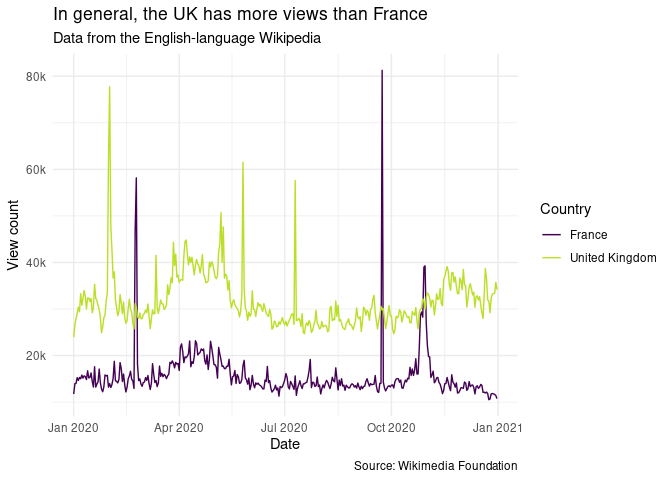

Code-along, Week 06: Wikipedia API
================
Alex Homer
28 October 2021

``` r
library(tidyverse)
library(here)
library(lubridate)
library(scales)
```

## Read data

This week we don’t start with any data. Instead we scrape it from APIs
belonging to Wikipedia. *(I believe Mine mentions APIs in the videos,
but she doesn’t use them: this is new material in a Code-Along, for
once!)* One gives us [articles in a
category](https://www.mediawiki.org/wiki/API:Categorymembers) from
Wikipedia’s article categorisation system [1], and the other gives us
[page views data for a given
article](https://wikitech.wikimedia.org/wiki/Analytics/AQS/Pageviews).
You can see the scraping script for this in this repo, in the
`data/scraping-script.R` file, and you should read the comments in there
first.

💡 *Why do we put our scraping script in a separate `.R` file?* 💡

We can now load the data [2].

``` r
country_data <- readRDS(here("data/countries-in-europe.Rds"))
views_data <- readRDS(here("data/country-article-views.Rds"))
```

## Cleanup

Let’s run the `glimpse` function and have a look at what data we’ve got
in the `views_data` dataset.

``` r
glimpse(views_data)
```

    ## Rows: 18,666
    ## Columns: 7
    ## $ project     <chr> "en.wikipedia", "en.wikipedia", "en.wikipedia", "en.wikipe…
    ## $ article     <chr> "Albania", "Albania", "Albania", "Albania", "Albania", "Al…
    ## $ granularity <chr> "daily", "daily", "daily", "daily", "daily", "daily", "dai…
    ## $ timestamp   <chr> "2020010100", "2020010200", "2020010300", "2020010400", "2…
    ## $ access      <chr> "all-access", "all-access", "all-access", "all-access", "a…
    ## $ agent       <chr> "all-agents", "all-agents", "all-agents", "all-agents", "a…
    ## $ views       <int> 5292, 5764, 6258, 7034, 8169, 6516, 7490, 6530, 14363, 936…

Because we scraped these data ourselves, there’s no data dictionary, but
inferring from the manual for the API: \* `project` is the project whose
views data we’re looking at (here, the English-language Wikipedia, or
“en.wikipedia” for short); \* `article` is an article on the project; \*
`granularity` is telling us over what time span the number of views was
counted \* `timestamp` is a character string telling us on what day the
data were counted \* `access` tells us what mode of access we’re
counting views for, e.g. the mobile app or the desktop site (here,
always `"all-access"`, so the aggregate figures); \* `agent` tells us
what type of viewer we’re counting views for, namely human or bor (here,
always `"all-agents"`, so again a total) \* `views` is the number of
page views

So four of these seven columns are the same in all rows of our dataset:

``` r
views_data %>%
  summarise(
    n_projects      = n_distinct(project),
    n_granularities = n_distinct(granularity),
    n_accesses      = n_distinct(access),
    n_agents        = n_distinct(agent)
  )
```

    ## # A tibble: 1 × 4
    ##   n_projects n_granularities n_accesses n_agents
    ##        <int>           <int>      <int>    <int>
    ## 1          1               1          1        1

We could remove these, but it might be useful to keep them around in
case we scraped any other data where these values were different.

The most notable issue with the data is the `timestamp` column; that
would be much more helpful as a date. The timestamp breaks down as: -
the first four digits represent the year; - the fifth and sixth
represent the month; - the seventh and eighth represent the day; - the
ninth and tenth are always `"00"`.

We can check that last claim:

``` r
views_data %>%
  mutate(digits910 = str_sub(timestamp, start = 9, end = 10)) %>%
  count(digits910)
```

    ## # A tibble: 1 × 2
    ##   digits910     n
    ##   <chr>     <int>
    ## 1 00        18666

We can parse this with `lubridate`, though we have to be a bit careful
because those ninth and tenth digits confuse it.

``` r
ymd("2020010100")
```

    ## Warning: All formats failed to parse. No formats found.

    ## [1] NA

Fortunately, this isn’t hard to fix. While we’re at it, we can make the
`access` and `agent` columns nicer-looking, and remove the underscores
from the `article` column (which are in the article URLs, but not
actually in their titles).

``` r
views_cleaned <- views_data %>%
  mutate(
    date_of_count = timestamp %>%
      str_sub(start = 1, end = 8) %>%
      ymd(), #Another mini pipeline!
    access = access %>%
      str_replace_all(pattern = "-", replacement = " ") %>%
      str_to_sentence(),
    agent = agent %>%
      str_replace_all(pattern = "-", replacement = " ") %>%
      str_to_sentence(),
    article = article %>%
      str_replace_all(pattern = "_", replacement = " ")
  ) %>%
  select(-timestamp) #We don't need that any more
```

💡 *Suppose we wanted the `article` column to instead reflect the names
of the entities in it: so we would replace the entries reading “Georgia
(country)”—which article has to have that name because Georgia is also
the name of a state in the US—with simply “Georgia”. How would we go
about doing that?* 💡

## Exploratory data analysis

Now, as ever, we can make nice plots.

``` r
views_cleaned %>%
  filter(article %in% c("United Kingdom", "France")) %>%
  ggplot(aes(x = date_of_count, y = views, colour = article)) +
  geom_line() +
  labs(
    x = "Date",
    y = "View count",
    colour = "Country",
    title = "In general, the UK has more views than France",
    subtitle = "Data from the English-language Wikipedia",
    caption = "Source: Wikimedia Foundation"
  ) +
  scale_y_continuous(labels = label_number(scale = 1e-3, suffix = "k")) +
  scale_colour_viridis_d(end = 0.9) +
  #end = 0.9 tweaks endpoint of colour scale so it's still visible
  theme_minimal()
```

<!-- -->

💡 *Do you think this would still be true on the French-language
Wikipedia? How could you check?* 💡

To round off, let’s find out which days had France with more views than
the UK. There are a couple of ways to do this, but I think this is
occasion where `pivot_wider` might actually be useful.

``` r
france_more <- views_cleaned %>%
  filter(article %in% c("United Kingdom", "France")) %>%
  mutate( #Transform to work better as column headers
    article = article %>%
      str_to_lower() %>%
      str_replace_all(pattern = " ", replacement = "_")
  ) %>%
  pivot_wider(
    names_from = article,
    names_prefix = "views_",
    values_from = views
  ) %>%
  filter(views_france > views_united_kingdom) %>%
  select(date_of_count, views_france, views_united_kingdom)
france_more
```

    ## # A tibble: 5 × 3
    ##   date_of_count views_france views_united_kingdom
    ##   <date>               <int>                <int>
    ## 1 2020-02-23           46606                31158
    ## 2 2020-02-24           58163                30337
    ## 3 2020-09-23           81260                29802
    ## 4 2020-10-29           39012                31736
    ## 5 2020-10-30           39268                29961

*(There’s a neater way of printing tables like the one above, so they
appear like the one below. Have a look in the `.Rmd` file corresponding
to this `.md` file to see how it’s done!)*

| Date              | Views of *France* | Views of *United Kingdom* |
|:------------------|------------------:|--------------------------:|
| 23 February 2020  |            46,606 |                    31,158 |
| 24 February 2020  |            58,163 |                    30,337 |
| 23 September 2020 |            81,260 |                    29,802 |
| 29 October 2020   |            39,012 |                    31,736 |
| 30 October 2020   |            39,268 |                    29,961 |

Table: Dates in 2020 when the *France* article had more views than the
*United Kingdom* article on the English-language Wikipedia.

💡 *The code chunk making the table above uses some code to make the
dates look nice. What it doesn’t do is add the appropriate suffix to the
date: so it writes “23 February” instead of “23rd February”. Can you
modify it to do that? It’s a bit tricky, because there’s no nice
lubridate function for it!* 💡

💡 *Can you find any reason why people would be looking up France on
these dates? I’m not sure I can!* 💡

This is a shorter write-up than usual, because so much went into the
scraping script. But there’s a lot we could do with these data!

[1] If you look at the bottom of any Wikipedia article, you’ll see the
categories to which it belongs.

[2] A quick note here: the things we’re getting in the
`countries-in-europe` dataset are what we obtained from Wikipedia, and
are what fit within English-language Wikipedia editors’ definition of a
“country”. As we’ve discussed before, what exactly counts as a country
is contentious, and inclusion on this list, or lack thereof, does not
imply either way the opinions of the course staff or of the University
of Edinburgh on the topic of which of these entities are countries!
Something similar also applies to the names of countries as reflected
here.
